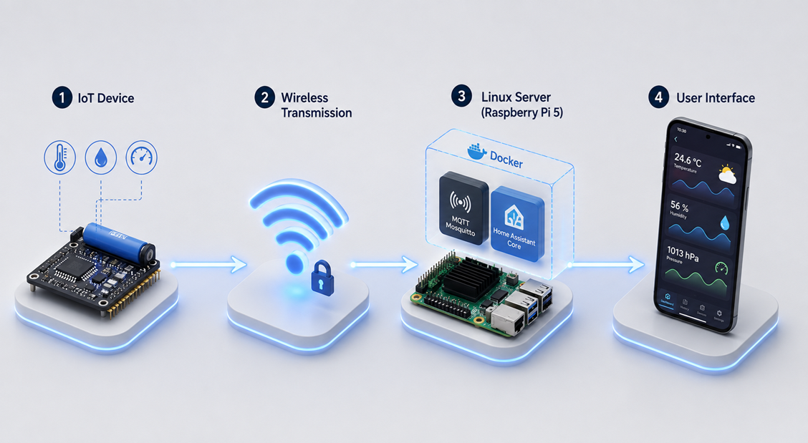
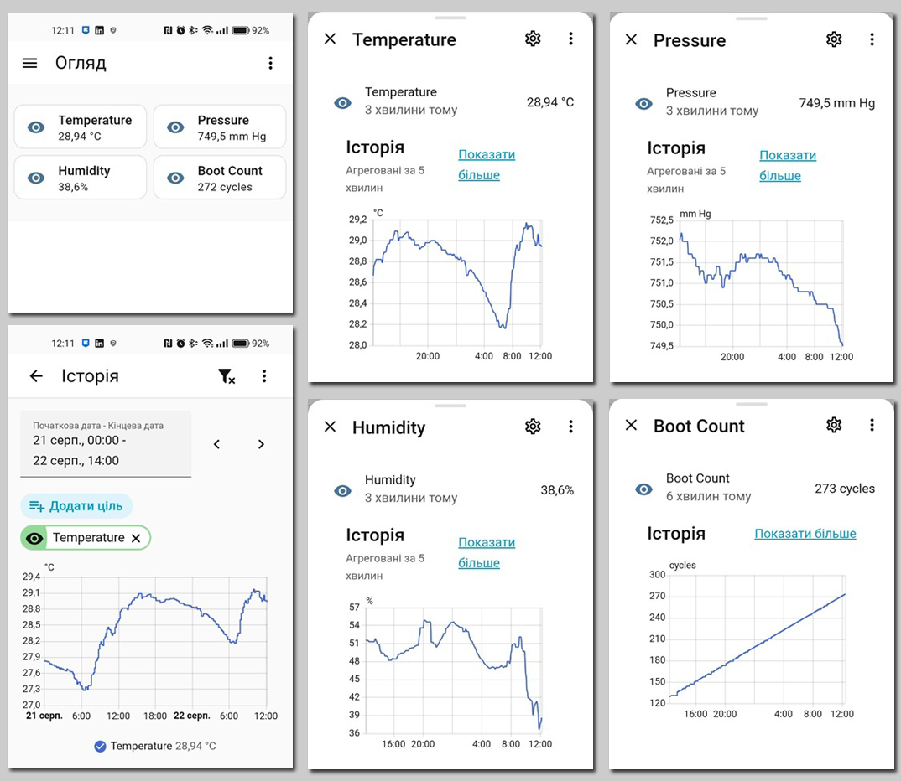
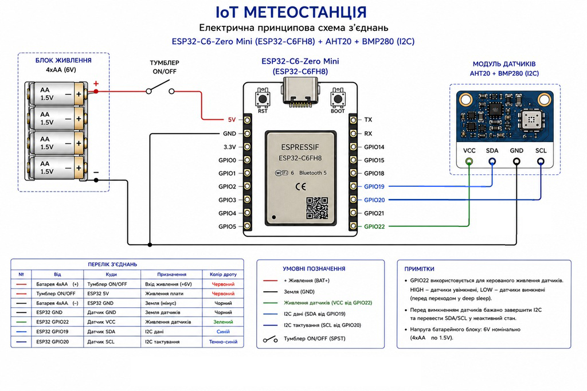

[Читати мене Українською](README_uk.md)

# 🌍 Autonomous Low-Power IoT Weather Station based on ESP32-C6

## 📌 Project Overview

This repository provides a practical example of building an **ultra-low-power wireless IoT Weather Station**. The device reads ambient temperature, relative humidity, and atmospheric pressure metrics, packages them into a structured JSON payload, and transmits them via a local MQTT broker to a Home Assistant server.

Designed as an educational and portfolio-grade project, it showcases the integration of modern RISC-V microcontrollers with containerized server infrastructures (Docker) and smart home ecosystems.

---

## 🏗️ System Architecture

The project utilizes a two-tier IoT topology (Client ➡️ Server) for data processing:

### 📊 Real-Time Mobile Dashboard & Analytics
Below is the compiled interface showcasing smooth real-time metric tracking and historical data charts within the Home Assistant Android app:

1. **The Endpoint (Client):** The ESP32-C6 wakes up via a hardware RTC timer ➡️ powers up the sensor array ➡️ captures climate metrics ➡️ connects to Wi-Fi 6 ➡️ publishes a JSON packet to the `home/weather/metrics` topic ➡️ cuts off sensor power ➡️ enters Deep Sleep mode for 10 minutes.

2. **The Server-Side (Raspberry Pi 5 running Raspberry Pi OS):**

&#x20;  * **Mosquitto MQTT Broker:** Receives data packets from the endpoint and maintains them in the message queue.

&#x20;  * **Home Assistant Core (Docker Container):** Subscribes to the broker, extracts metrics using built-in YAML value templates, and maps them to unique entities (`unique_id`).

3. **The User Interface:** The official Home Assistant Android mobile app displays a clean dashboard panel and renders smooth historical graphs for daily and weekly analytics.

---

## ⚡ Key Features

* **Cutting-Edge Core:** Powered by the **ESP32-C6** chip, featuring an energy-efficient single-core RISC-V processor with native Wi-Fi 6 support.

* **Deep Sleep Optimization:** Achieves a real-world measured current draw of **only 500 µA (0.5 mA)** during sleep cycles, without any destructive desoldering of onboard dev kit components.

* **Smart Sensor Power Management:** Sensors are powered directly through a digital GPIO22 pin. Before entering sleep mode, the MCU shuts down the power rail and transitions the I2C bus (SDA/SCL) into a High-Impedance (High-Z) state. This completely prevents parasitic leakage and eliminates sensor self-heating issues.

* **Outstanding Battery Autonomy:** Powered by 4xAA/AAA batteries (6V nominal). Due to rigorous power optimizations, the station can operate for several months on a single battery pack.

* **100% Local & Secure:** Data transmission is constrained within the local network to a self-hosted Mosquitto broker, maintaining full privacy without relying on third-party cloud platforms.

* **Persistent Boot Counting:** The boot counter persists through sleep periods by utilizing the microcontroller's low-power RTC RAM storage.

---

## 🛠️ Hardware Setup & Wiring

The physical hardware layout is composed of the following modules:

1. **Microcontroller:** ESP32-C6-Zero Mini (ESP32-C6FH4 with 4MB Flash).

2. **Sensors:** Combined precision AHT20 (temperature & humidity) + BMP280 (temperature & barometric pressure) board communicating via I2C.

3. **Power Source:** 4xAA/AAA battery holder.

4. **Control Switch:** A physical ON/OFF toggle switch (SPST) to isolate the battery bank during storage.

5. **Diagnostics Bridge:** Features an integrated pin header with a removable jumper. This allows developers to easily bridge a multimeter in series with the main power rail for real-time current measurements.

*A detailed schematic diagram and wire connection list can be found below:*

---

## 📂 Repository Structure

* `/firmware` — Final source code (Arduino IDE `.ino` sketch) and network configuration template.

* `/hardware` — Schematic diagram, connection list, and high-res photos of the soldered prototype board.

* `/home-assistant` — Configuration code snippets for the `configuration.yaml` file.

* `/docs` — Step-by-step setup guides for Mosquitto MQTT and Docker installation on Raspberry Pi OS.

* `/images` — UI dashboard screenshots, performance charts, and architecture diagrams.

---

## 📜 License

This project is fully open-source and released under the MIT License. Feel free to use, modify, and distribute the code for both educational and commercial use cases.

